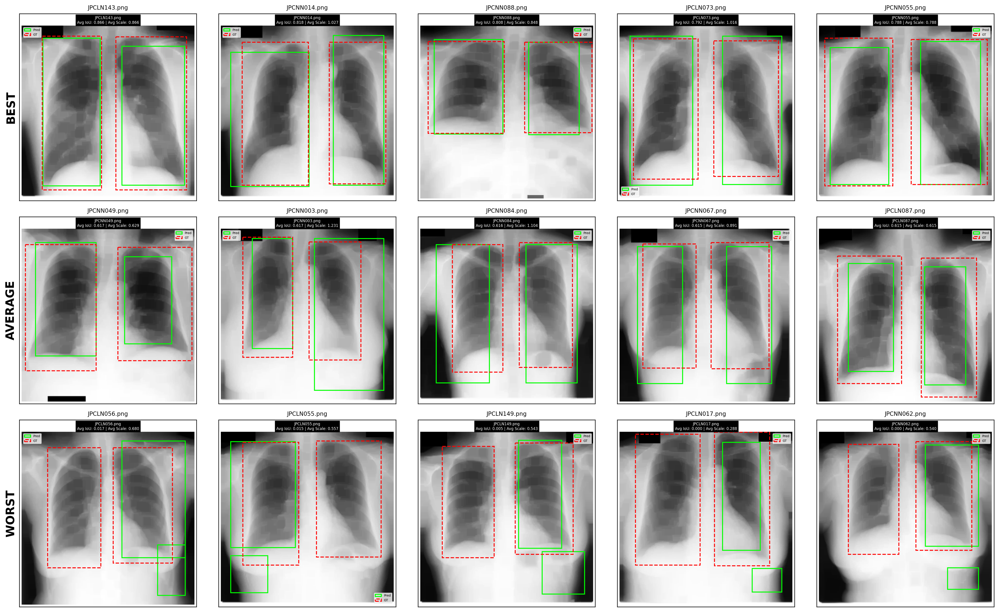

# Lung Localization in Chest X-ray Images

This repository contains the implementation for the Digital Image Processing (PCD) course final project, titled **"Lung Area Localization in Chest X-ray Images Using Progressive Distance-Based Masking and Anatomical Patterns"**.

## Paper
Read the full paper here: 

**[https://doi.org/10.5281/zenodo.18448574](https://doi.org/10.5281/zenodo.18448574)**

## Overview
This project implements a classical computer vision approach to segment lung areas in Chest X-Ray (CXR) images. Unlike modern Deep Learning approaches (U-Net, etc.), this method relies on anatomical priors, morphological operations, and progressive distance-based masking to achieve robust segmentation without heavy training data.

### Key Features
- **Preprocessing**: Adaptive histogram_equalization (CLAHE) and Gaussian smoothing.
- **Body Extraction**: Thresholding and morphological reconstruction to isolate the body area.
- **Segmentation**: Novel distance-based thresholding and watershed algorithm to separate lungs.
- **Analysis**: Rib pattern detection using autocorrelation and FFT to validate lung regions.

## Project Structure

```bash
project/
├── data/               # Input Chest X-Ray images
├── notebooks/          # Jupyter notebooks for experiments and visualization
├── results/            # Output segmentation masks and evaluation metrics
├── scripts/            # Helper scripts (demo, comparison, data organization)
├── src/                # Core source code package
│   ├── analysis/       # Rib detection, periodicity, and pattern analysis
│   ├── preprocessing/  # Image enhancement (CLAHE) and body mask extraction
│   ├── segmentation/   # Distance-based thresholding and watershed logic
│   └── utils/          # Visualization tools and image processing helpers
├── tests/              # Unit tests
├── main.py             # Main entry point for running the pipeline
├── requirements.txt    # Python dependencies
└── setup.py            # Package installation script
```

### Folder Descriptions
- **`src/preprocessing/`**: Contains `body_extraction.py` and `enhancement.py`. Handles the initial image processing chain including smoothing, CLAHE, and generating the initial coarse body mask.
- **`src/segmentation/`**: Core logic for the progressive distance-based masking (`distance_based.py`) and watershed algorithms (`watershed.py`) to refine lung boundaries.
- **`src/analysis/`**: Includes `rib_detection.py` and `periodicity.py` to analyze texture patterns within the segmented regions, ensuring they match anatomical expectations of ribs.
- **`src/utils/`**: General utilities for `visualization.py` (plotting results) and `image_utils.py` (array manipulations).
- **`scripts/`**: executable scripts for specific tasks like running demos (`demo.py`), comparing methods (`compare.py`), or organizing datasets.
- **`notebooks/`**: Interactive environments for testing individual functions and visualizing intermediate steps.

## Results


*Figure 1: Performance visualization on the JSRT dataset. The image displays a comparison of the **5 Best** (top row), **Average** (middle row), and **Worst** (bottom row) results. 

## Installation

1. Clone the repository:
   ```bash
   git clone https://github.com/fae-ld/Lung-Localization
   cd Lung-Localization
   ```

2. Install dependencies:
   ```bash
   pip install -r requirements.txt
   ```

   **Requirements:**
   - `numpy`
   - `matplotlib`
   - `scikit-image`
   - `scipy`
   - `opencv-python`

## Usage

You can run the main pipeline using the provided `main.py` script:

```bash
python main.py
```

Or run the specific demo script:

```bash
python scripts/demo.py
```

### Example Code
To use the segmentation pipeline in your own script:

```python
from src.preprocessing.body_extraction import extract_body_mask
from src.segmentation.distance_based import apply_distance_thresholding, calculate_8_way_distances
from skimage import io

# Load image
img = io.imread("data/sample_cxr.png", as_gray=True)

# 1. Extract Body
body_mask, _, _ = extract_body_mask(img)

# 2. Calculate Distance Map
dist_map = calculate_8_way_distances(body_mask)

# 3. Apply Segmentation
lung_mask = apply_distance_thresholding(dist_map, method='sigma')
```

## License
[MIT License](LICENSE)


## Acknowledgments

**Note**: This project is mainly exploratory and is open to discussion and collaboration.
